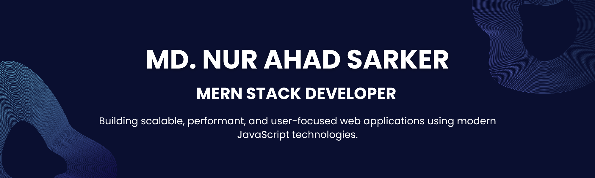

  

---

## Professional Summary

Frontend-centric **MERN Stack Developer** with strong experience in building production-ready web applications.  
I specialize in **React-based UI architecture**, REST API integration, and secure backend systems using Node.js and MongoDB.  
Focused on **clean code, performance optimization, and real-world problem solving**.

---

## Core Competencies

<table>
<tr>
<td width="50%">

### Frontend Engineering
- React.js (Hooks, Context, SPA Architecture)
- Next.js (SSR, Routing)
- JavaScript (ES6+)
- Tailwind CSS, Bootstrap
- Responsive & Accessible UI

</td>
<td width="50%">

### Backend & Infrastructure
- Node.js & Express.js
- RESTful API Design
- MongoDB & Mongoose
- JWT Authentication
- Firebase Authentication
- API Security & Data Validation

</td>
</tr>
</table>

---

## Technology Stack

---

## Selected Projects

### LocalChefBazaar — Full-Stack Marketplace
A production-ready food marketplace platform with role-based authentication and secure APIs.

**Tech Stack:** React, Node.js, Express, MongoDB, JWT  
**Features:**
- Role-based access control
- Secure authentication
- Scalable REST API architecture

🔗 [Local Chef Bazaar](https://local-chef-bazaar-c2f58.web.app/) 

---

<h2>GitHub Analytics</h2>

<table align="center">
  <tr>
    <td>
      
    </td>
    <td>
      
    </td>
  </tr>
</table>

---

## Professional Goals
- Advanced full-stack system design
- High-performance React applications
- Remote & international development roles
- Open-source collaboration

---

## Contact & Presence

- LinkedIn: **[LinkedIn](https://www.linkedin.com/in/nur-ahad/)**
- Email: **nurahadrobi451@gmail.com**

---

**Open to full-time roles, remote opportunities, and impactful projects.**

